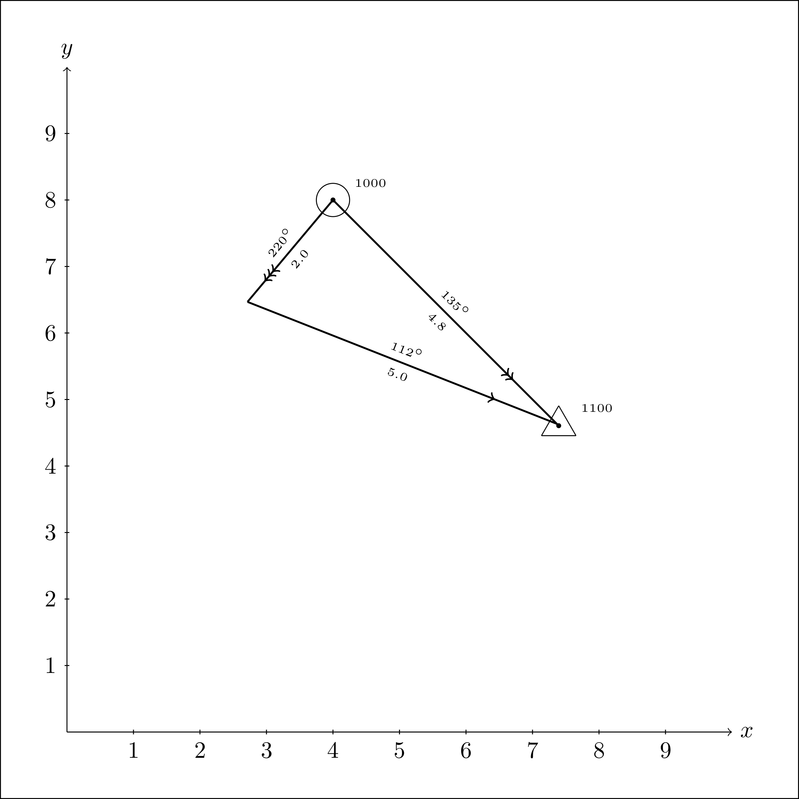

# Omipy : Creating Coastal Navigation Figures With Python
This short class is a wrapper around pytikz to generate coastal navigation figures. Fixes, lines of positions, course, track, current, etc. 

## Examples
### Basic usage
Drawing a Figure manually. 
```
from omipy import Omipy

figure = Omipy(10, 10, draw_coord = True)
figure.draw_fix(x = 1, y = 1, time='1000')
figure.set_current(set = 0, drift = 5, x=6, y=1)
figure.set_course(s = 5, c = 90, x = 1, y = 1)
figure.set_track(cog = 45, sog = 7.1, x=1, y=1)
figure.make_diagram(time="1100")
figure.print_file('myfigure-1.png', dpi=500)
```


### Solving for track
When the navigation is performed without anticipation of the current. The current and course vectors are known. The resulting track (COG, SOG) is calculated. 
```
from omipy import Omipy

figure = Omipy(10, 10, draw_coord = True)
figure.draw_fix(x = 1, y = 1, time='1000')
figure.set_current(set = 0, drift = 5, x=6, y=1)
figure.set_course(s = 5, c = 90, x = 1, y = 1)
figure.solve_track("1100")
figure.print_file('myfigure-2.png', dpi=500)
```


### Solving for course
When the navigation anticipates the impact of the current. The current vector, the course over the ground (COG) and the surface speed are known. The speed over the ground and course are calculated. 
```
from omipy import Omipy

figure = Omipy(10, 10, draw_coord = True)
figure.draw_fix(x = 4, y = 8, time='1000')
figure.set_track(cog = 45+90, x=4, y = 8)
figure.set_current(set = 220, drift = 2, x = 4, y = 8)
figure.solve_course(s = 5.0, time = "1100")
figure.print_file('myfigure-3.png', dpi=500)
```



